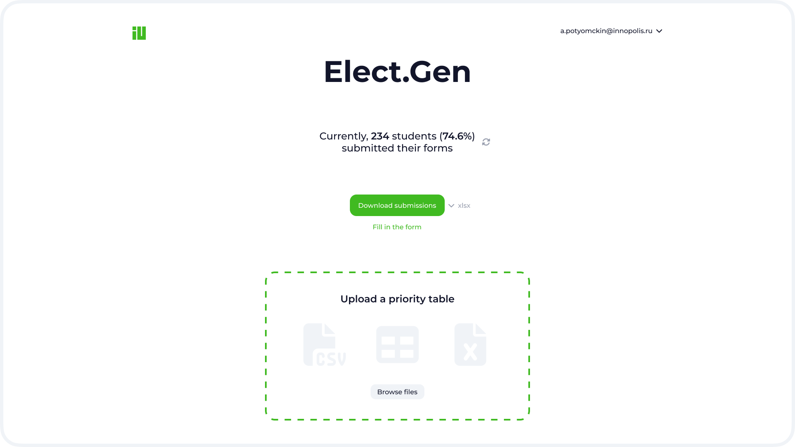
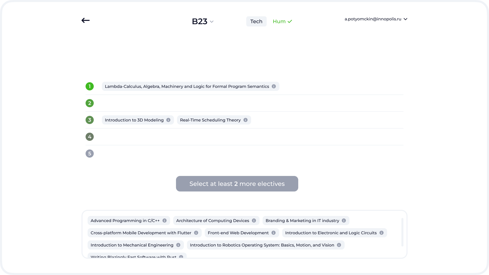

# Elect.Gen

A distribution system to assign students to electives.

## ⌛ Problem

Manually distributing students to electives every year is tedious and time-intensive.

## 🚀 Solution

This system automates the abovementioned process using a genetic algorithm. We also provide a convenient GUI to ease the integration into the university ecosystem.

## 🖼️ Screenshots

## 🤓 Usage

Currently, we&CloseCurlyQuote;re a WIP, so you can only launch our services separately. Move on to the corresponding repository to learn more:

- **[Core](/services/core/)** / Algorithm
- **[Front End](/services/frontend/)** / Web-Based GUI
- **[Back End](/services/backend/)** / Glue ✨

## 🎉 Team

We are [SDR](https://gitlab.pg.innopolis.university/sdr-sum24/)&mdash;a team of passionate developers and students of Innopolis University aiming to improve our beloved university&CloseCurlyQuote; IT infrastructure. Our team consists of five members:

- **[Arsen Galiev](https://gitlab.pg.innopolis.university/a.galiev)** / Front-End Developer
- **[Asqar Arslanov](https://gitlab.pg.innopolis.university/a.arslanov)** / Front-End Developer
- **[Ilya-Linh Nguen](https://gitlab.pg.innopolis.university/i.nguen)** / DevOps Engineer
- **[Kirill Efimovich](https://gitlab.pg.innopolis.university/m.malov)** / Core Engineer
- **[Maksim Malov](https://gitlab.pg.innopolis.university/m.malov)** / Core Engineer

## 📄 License

The project is licensed under the [MIT License](/LICENSE).

---

(c) [SDR](https://gitlab.pg.innopolis.university/sdr-sum24/) / [Innopolis University](https://innopolis.university/en/). All rights reserved.
